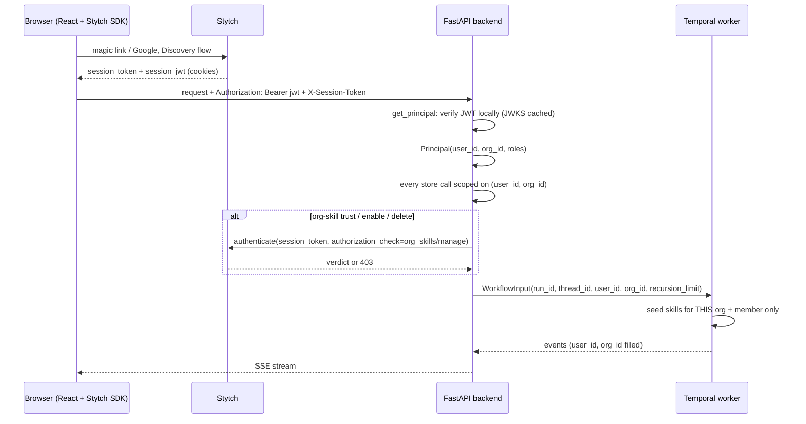

# DeepAgent Authentication & Tenancy

*How user auth works, how Stytch B2B models it, how DeepAgent adapts it, why the design looks the way it does, how the code runs, and a step-by-step demo walkthrough.*

---

## Part 1 — How user authentication works (the fundamentals)

Every multi-user system has to answer three separate questions on every request. They are often blurred together, and most security bugs come from blurring them.

**1. Authentication: who is this?**
The caller proves they hold a credential that only a specific person could hold. Passwords, one-time codes, magic links, and OAuth ("sign in with Google") are all ways of establishing this once. The outcome of a successful login is a *session*: a server-side record that says "this browser is Alice until time T".

**2. Authorization: is this person allowed to do this?**
Given who they are, may they perform this action on this object? There are two flavors:

- *Ownership* — Alice may read her own conversation because it is hers.
- *Role* — Alice may approve a company-wide skill because she is an admin of the company.

**3. Tenancy: which slice of the data is this person even inside?**
In a business product, users belong to organizations, and an organization's data is a walled garden. Bob at Acme should never see Carol's data at Globex, and the system should not even confirm that Carol's data exists. Tenancy is usually implemented as *row scoping*: every stored row carries an owner, and every query filters on the caller's identity.

### Sessions and tokens

After login, the browser needs to prove its identity on every later request without re-entering credentials. It carries a token. There are two common shapes, and they trade off differently:

| | Opaque session token | Signed JWT |
|---|---|---|
| What it is | A random string; meaningless on its own | A signed document containing claims (who, which org, roles, expiry) |
| How the server checks it | Looks it up in the identity provider (a network call) | Verifies the signature with a public key it already has (no network) |
| Cost per request | One round trip | Microseconds |
| Revocation | Immediate: once revoked, the lookup fails | Lags: a signed token stays valid until its `exp`, typically 5 minutes |
| Freshness of roles | Always current | As of when the token was minted |

A production design usually uses **both**: the fast JWT for the many ordinary requests, and the opaque token for the few requests where you must know *right now* that the session is still alive and the person still has the role.

### Signature verification and JWKS

A JWT is signed with the identity provider's private key. The provider publishes the matching public keys at a well-known URL called a JWKS (JSON Web Key Set). A server fetches that once, caches it, and can verify any token locally. Verification checks the signature, the audience (this token was minted for *our* project, not someone else's), the issuer, and the time window (`iat`, `nbf`, `exp`). A forged token fails the signature; a token for another project fails the audience; an expired token fails `exp`.

### Role-based access control (RBAC)

Roles are named bundles of permissions. Permissions are (resource, action) pairs. An RBAC policy says "role `admin` may perform `manage` on resource `org_skills`". The session carries the member's roles; the check asks "does any of this member's roles grant this (resource, action)?".

### Three things people get wrong

- **Confirming existence.** Returning 403 Forbidden for someone else's object tells an attacker the object exists and what its id looks like. Returning 404 for anything the caller doesn't own reveals nothing. This is the standard defense against IDOR (insecure direct object reference).
- **Trusting the client for identity.** A request body that says `"user_id": "alice"` is not identity. Identity must be derived from the credential, once, on the server, and everything downstream must use that derived value.
- **Things that can't send headers.** An `<iframe>` or `<a download>` cannot attach an `Authorization` header. If you protect files only with a bearer header, previews and downloads break. The fix is a short-lived signed URL: the authenticated caller asks the server for a link that carries its own proof of authorization, valid for a minute.

---

## Part 2 — How Stytch B2B models it

Stytch is the identity provider. Its B2B product is built for exactly the organization-shaped world above. The vocabulary:

| Stytch term | Meaning | Maps to in DeepAgent |
|---|---|---|
| **Project** | Your Stytch account for this app, with Test and Live environments | The `STYTCH_PROJECT_ID` / `STYTCH_SECRET` keys |
| **Organization** | A tenant: a company or workspace | `org_id` on every row |
| **Member** | A person *inside one organization*. The same email in two orgs is two members with two `member_id`s | `user_id` on every row |
| **Member session** | A logged-in member in one org. Carries `member_id`, `organization_id`, `roles` | The `Principal` |
| **`session_token`** | Opaque token for the session | `X-Session-Token` header |
| **`session_jwt`** | Signed JWT for the same session, 5-minute lifetime, auto-refreshed by the browser SDK | `Authorization: Bearer` header |
| **Discovery flow** | Login by email first, then choose which of your organizations to enter (or create one) | The sign-in screen |
| **Session exchange** | Swap a session in org A for a session in org B, for a member of both | How Dana moves between Acme and Globex |
| **RBAC policy** | Project-level resources, actions, and roles | The `org_skills` / `manage` permission |
| **`stytch_admin`** | Built-in role, granted to an org's first member and to whoever an admin promotes | "Admin" in the UI |
| **`stytch_member`** | Implicit default role every member has; cannot be assigned explicitly | "Member" in the UI |
| **`authorization_check`** | An optional field on the session-authenticate call: "also confirm this member may do *action* on *resource* in *org*" | The network-backed admin gate |

Stytch's Python SDK exposes two verification calls, and the difference is the heart of our design:

- `sessions.authenticate_jwt(session_jwt)` verifies locally against the cached JWKS. No network unless the token is stale. Fast, but revocation lags up to five minutes.
- `sessions.authenticate(session_token=…, authorization_check=…)` calls Stytch. Slower, but a revoked session fails instantly and the RBAC verdict is Stytch's, evaluated against the current policy.

Everything above was verified against the installed SDK source rather than remembered; the exact signatures and line references are in `docs/STYTCH_NOTES.md`.

---

## Part 3 — How DeepAgent adapts it

DeepAgent was a single-user demo: one implicit user, no login, every conversation visible to whoever opened the page. The codebase had been built anticipating this work: every stored row already carried empty `user_id` and `org_id` columns, conversation ids were already server-minted and unguessable, and the workflow input already carried per-run context to the worker. The job was to fill those in, not to re-architect.

### The shape of a request now

Identity is resolved **once**, in one FastAPI dependency, into a `Principal`. Nothing else in the system ever looks at a header again. The worker never sees a header at all: it trusts the two ids in `WorkflowInput` because the API is the only thing that can start a workflow.

### Hybrid verification by route

| Route class | Examples | Verification | Why |
|---|---|---|---|
| Hot paths | list/read threads, start a run, stream, sign an artifact | Local JWT | Dozens of calls per minute; a network hop each would be felt |
| Sensitive, rare | trust / enable / delete an **org** skill | Local role check, then network call with the opaque token and an RBAC `authorization_check` | An org skill is injected into every colleague's agent. A revoked or demoted admin must be stopped *now*, not in five minutes |

The browser therefore sends both tokens on every request. Sending both costs nothing; deciding per route what to check with them is where the value is.

### What "tenancy" concretely means here

| Data | Owned by | Visible to |
|---|---|---|
| Conversations, runs, event streams, artifacts | (member, org) pair | That member, in that org |
| **User**-tier skills | (member, org) pair | That member only |
| **Org**-tier skills | org | Every member of the org; only admins can trust, enable, or delete |
| Built-in skills (shipped in the repo) | nobody | Everyone; the on/off override is project-wide, so only admins may flip it |

The scoping lives inside the storage seam (`backend/store.py`). Every store function takes an optional identity; when it is present, "does this row exist?" and "does the caller own this row?" are the same question with the same answer. That is what makes 404-not-403 automatic rather than something each route has to remember.

### Artifacts: signed URLs

Previews render in a sandboxed `<iframe>` and downloads are plain links. Neither can carry a bearer header. So an authenticated call `GET /artifacts/{run}/{file}/sign` checks ownership, path containment, and existence, then returns a URL carrying an expiry and an HMAC-SHA256 over (run, file, expiry) using a backend secret, valid for 60 seconds. The serve route takes no bearer at all; with auth on it accepts only a valid signature, and re-applies the original path-traversal guard and download forcing on every serve. Missing, forged, expired, or wrong-file signatures are all a 404.

### Quotas

Each organization gets a daily run cap (default 100). Over the cap, `POST /runs` returns 429 with the limit, the count used, the reset time at the next local midnight, and a `Retry-After` header. It counts registry rows, so it needs no new storage.

### Pre-auth data

Turning the flag on would have made every existing conversation invisible, because rows with no owner match nobody. Two mechanisms handle that:

1. **Backfill** at first startup stamps every unowned row with a placeholder identity (`legacy`/`legacy`), so nothing is lost but nothing leaks.
2. **Claim** (`backend/claim_legacy.py`) moves that whole bucket to a real member and organization once one exists, and can un-hide the conversations that were archived when the sidebar was introduced.

---

## Part 4 — Design decisions and why

| Decision | Why |
|---|---|
| **Everything behind one flag, `AUTH_ENABLED`, default off** | It is the rollback switch. With the flag off the code paths collapse to the pre-auth behavior byte for byte: no scoping, no gate, no quota, no signing, no Stytch client is even constructed. A test proves it. |
| **Identity resolved once, in a dependency, into an immutable `Principal`** | One place to audit. Routes cannot disagree with each other about who is calling, and the worker cannot be handed a different answer than the API used. |
| **`Principal.user_id` is the Stytch `member_id`, not the email** | Emails are shared across orgs (Dana) and can change. Member ids are unique per (person, org) and stable. |
| **Rows scoped on the (member, org) pair, not member alone** | A member id is already org-specific in Stytch, but scoping on both makes the invariant explicit and cheap to check, and it is the shape the future Postgres row-level-security policy will use. |
| **Unknown and unowned both answer 404** | Never confirm the existence of something the caller doesn't own. The store returns the same `None`/`False` for both, so routes can't accidentally distinguish them. |
| **Visibility is checked before authorization** | An org member who tries to trust an org skill gets 403 (they can see it; they may not change it). A member of another org gets 404 (from their side it doesn't exist). Reversing the order would let outsiders probe for skill ids by watching for 403s. |
| **Org-skill writes use the network path with an RBAC check; user-skill writes don't** | An org skill reaches every colleague's agent, so it is a trust decision and must reflect the current Stytch state. A user skill affects only its owner; ownership was already proven by visibility. |
| **The mixed-token guard** | If the bearer JWT and the session token belong to different sessions, the request is rejected even when both are individually valid. Otherwise a valid admin JWT could be combined with an unrelated live session token. |
| **The worker trusts `WorkflowInput` and never re-derives identity** | The worker has no request, no headers, no Stytch client. The only way to start a workflow is through the API, which already resolved identity. Re-deriving would only add a second place to get it wrong. |
| **The store seam takes an optional identity instead of a global** | The seam's signatures stay swap-compatible with the planned Postgres implementation, and `None` keeps the legacy behavior for the flag-off path and the tests. |
| **Storage stays JSON files; no database was introduced** | This is dev/staging auth. Row scoping in the seam is correct but relies on every query passing the identity. Production row-level security in Postgres, where the database enforces it, is a separately tracked step and is stated as such in the code. |
| **Signed artifact URLs instead of cookies on the file route** | Cookies on a separate API origin would need CORS credentials and CSRF thinking; a signature bound to (run, file, expiry) is simpler, stateless, and can't be reused for another file. The secret falls back to a random per-process key if unset, so links die on restart unless `ARTIFACT_SIGNING_SECRET` is configured. |
| **`/health` stays unauthenticated** | Load balancers and the start script need it, and it returns nothing tenant-specific. |
| **Built-in skill toggles are admin-only** | The toggle is project-wide, not per tenant. A plain member should not be able to switch off a skill for every organization. This was a judgment call beyond the original plan. |
| **"Switch organization" logs out and returns to Discovery** | Stytch can exchange a session in place, but listing a member's *other* organizations needs a discovery-phase token that a logged-in member no longer holds. The round trip is the honest implementation. |
| **Recursion limit 30, not 15** | The original plan asked for 15. Live runs hit `GraphRecursionError` at 15 after three or four tool calls because the agent framework's planning and middleware steps count against the budget. 30 was restored as the default and made configurable per run. |
| **Skills are re-announced on later turns of a thread** | The agent reads a skill file once; on later turns the text is already in its history, so it never re-reads, and the UI showed nothing. Each continuing turn now scans the checkpoint for skills read earlier and announces them up front as "Skill in context". Only skills still seeded for that tenant are announced. |
| **The legacy bucket is claimable, not deleted or auto-assigned** | On first start there is no member to assign the old data to. Parking it under a placeholder identity keeps it safe; the claim tool hands it to a real owner later, explicitly. |

---

## Part 5 — How the codebase runs for auth

### File map

| File | Responsibility |
|---|---|
| `backend/auth.py` | `Principal`, the flag, the process-wide Stytch client, `get_principal` (local JWT), `reverify_network` (opaque token + RBAC), `require_role` |
| `backend/main.py` | Every route takes `p: Principal = Depends(get_principal)`; tenancy helpers; signed artifact URLs; quota; startup backfill |
| `backend/store.py` | The storage seam. `Identity`, ownership and visibility rules, optional `identity=` on every function, `backfill_identity`, `claim_identity` |
| `backend/claim_legacy.py` | CLI to move the legacy bucket to a real owner |
| `temporal/workflows.py`, `temporal/activities.py` | `WorkflowInput` / `AgentInput` carry `user_id`, `org_id`, `recursion_limit`; the activity seeds skills for that tenant and announces carried-over skills |
| `agent/skills.py` | `seed_files(user_id, org_id)` narrows the registry to built-ins + this org's + this member's rows |
| `agent/context.py` | `RunContext` carries the ids for anything inside a run that needs them |
| `frontend/src/auth/stytch.ts` | Client singleton behind `VITE_STYTCH_PUBLIC_TOKEN`; `authHeaders()` builds both headers from the SDK's tokens |
| `frontend/src/auth/Login.tsx` | Sign-in card and the `/authenticate` token-exchange handler (Stytch prebuilt UI, Discovery flow) |
| `frontend/src/App.tsx` | The session gate: `/authenticate` → login → shell |
| `frontend/src/net/api.ts`, `net/sse.ts` | Every REST and SSE call attaches the headers; `signArtifactUrl` |
| `frontend/src/components/AccountMenu.tsx` | Org name, email, switch org, log out |
| `frontend/src/components/blocks/ArtifactBlock.tsx` | Fetches a fresh signed URL for the preview, the overlay, and each download click |
| `docs/STYTCH_NOTES.md` | Every SDK name used, verified from installed source with line references |

### Startup, flag on

1. `backend/auth.py` is imported. If `AUTH_ENABLED=true` it builds the Stytch client immediately; missing keys stop the process with a clear error rather than silently running open.
2. `backend/main.py` loads the run registry and thread store, then runs the backfill: any row with no owner is stamped `legacy`/`legacy`. Idempotent.
3. Routes register with the `get_principal` dependency.

### A request, flag on

1. The browser's `authHeaders()` reads `session_jwt` and `session_token` from the Stytch SDK and sets `Authorization: Bearer …` and `X-Session-Token`.
2. `get_principal` takes the bearer, calls `sessions.authenticate_jwt_async`. The SDK verifies signature, audience, issuer, and time window against the cached JWKS. Any failure, of any kind, becomes one generic 401; the real reason goes to the server log only.
3. The route calls store functions with `store.Identity(p.user_id, p.org_id)`. Rows the caller doesn't own are invisible.
4. For an org-skill write: `require_role(p, "stytch_admin")` first (403 if not), then `reverify_network` sends the opaque token to Stytch with `AuthorizationCheck(org, "org_skills", "manage")`. Stytch's 403 becomes ours; a dead session becomes 401; the returned identity must match the bearer's or it's 401.
5. For a run: the registry row and the thread are stamped with the caller's ids, the quota is checked, and the ids ride in `WorkflowInput` to the worker.
6. In the worker, `seed_files(user_id, org_id)` builds the agent's virtual skills folder from built-ins plus this org's org skills plus this member's user skills. Nothing else exists from the agent's point of view.
7. Every event the run emits carries the run's `user_id` and `org_id` from its registry row.

### The same request, flag off

`get_principal` returns a fixed `LEGACY` principal without touching the SDK. `_ident()` returns `None`, so every store call runs unfiltered. `reverify_network` and `require_role` return immediately. The artifact route needs no signature. The quota is not enforced. New rows are stamped `null`, exactly as before.

### Configuration

| Variable | Purpose |
|---|---|
| `AUTH_ENABLED` | The switch. `false` by default. |
| `STYTCH_PROJECT_ID`, `STYTCH_SECRET`, `STYTCH_ENV` | Server keys; `test` or `live` |
| `VITE_STYTCH_PUBLIC_TOKEN` | Browser key (frontend `.env`). Unset = the UI boots without a login screen |
| `ARTIFACT_SIGNING_SECRET`, `ARTIFACT_SIGN_TTL_SECS` | Signed-link key and lifetime (default 60 s) |
| `RUN_QUOTA_PER_ORG_PER_DAY` | Daily run cap per org (default 100) |
| `AGENT_RECURSION_LIMIT` | Agent step budget per run (default 30) |

### Tests

Six standalone proofs need no running stack and no Stytch network (`tests/test_idor.py`, `test_forged_jwt.py`, `test_org_scope.py`, `test_admin_gate.py`, `test_quota.py`, `test_flag_off.py`). The forged-JWT test signs real RS256 tokens with a throwaway key and swaps the JWKS lookup for an in-process fake, so it exercises the real verification path deterministically. `tests/proof_auth_live.py` runs the same scenarios against the live stack with real Stytch sessions and real agent runs; it passed 77 of 77 checks.

---

## Part 6 — Step-by-step demo walkthrough

### The cast

Two demo companies exist in the Stytch Test project, with these sign-ins (all deliver to one inbox via plus-addressing, so any of them can be used live with a magic link):

| Person | Email | Org | Role |
|---|---|---|---|
| Alice | `…+acme-alice@gmail.com` | Acme Corp | admin |
| Bob | `…+acme-bob@gmail.com` | Acme Corp | member |
| Dana | `…+dana@gmail.com` | Acme Corp **and** Globex Industries | member at Acme, admin at Globex |
| Carol | `…+globex-carol@gmail.com` | Globex Industries | admin |

Acme has an org skill, `acme-brand-voice`. Globex has `globex-compliance`. Bob has a private user skill.

### Before the talk

1. Start the stack with `start.bat`. Confirm the backend window shows no errors and, on first start after enabling auth, one `auth backfill` line.
2. Confirm `http://localhost:3000` shows the sign-in card, not the chat.
3. Have the backend window visible on a second screen: every 401 and 403 logs its real reason there while the wire response stays generic. That contrast is a good thing to point at.

### Act 1 — "Nothing is reachable without a session" (2 minutes)

1. Show the sign-in card. Say: the old chat never renders until Stytch says who you are.
2. In a terminal, run `curl -i http://127.0.0.1:8000/threads`. Show the 401 and the deliberately generic body.
3. Run it again with `-H "Authorization: Bearer garbage"`. Same 401, same body. Point at the backend window: the log says *why*, the client can't tell.

### Act 2 — "Two people, one company" (4 minutes)

1. Sign in as Alice (magic link from the inbox). Land in Acme Corp. Point at the org name in the top-right corner.
2. Show the sidebar: her conversations only. Open the Rocket Skates conversation. Point at the *Skill activated: acme-brand-voice* block and the inline preview of the generated page. Say: that preview is loading through a 60-second signed link, because an iframe can't send a login header.
3. Open Skills. Show the Acme org skill under Organization. As admin, toggle it off and on.
4. Open a private window, sign in as Bob. Same org name, different sidebar: only his conversation. Open Skills: the same org skill, plus `bob-scratchpad` under Your skills, which Alice never sees.
5. As Bob, try to toggle the org skill. It snaps back. Point at the backend window: `rbac denied`. Say: the role check is server-side, verified against Stytch on every org-skill write.

### Act 3 — "One person, two companies" (4 minutes)

1. Sign in as Dana. After the magic link, Stytch's Discovery screen lists both companies. Pick Acme.
2. Sidebar: one conversation. Skills: the Acme skill. Account menu: member.
3. Account menu → Switch organization → sign-in → Dana again → pick Globex.
4. Everything changes: the org name, a different conversation, only the Globex skill, and now she is an admin. Say: same email, two member ids, and every row is scoped on the (member, org) pair.

### Act 4 — "Companies never meet" (2 minutes)

1. Sign in as Carol at Globex. Show her sidebar and Skills. Say: from Globex, Acme's skill doesn't exist. Not forbidden, nonexistent.
2. Optionally, from a terminal with Carol's headers, request one of Alice's thread ids and show the 404. (`tests/proof_auth_live.py` does this automatically if you'd rather show the script output.)

### Act 5 — "Skills follow the company into the agent" (3 minutes)

1. As Alice, ask: *"Write a short Acme memo about the holiday schedule. Do not search the web."* Watch the brand-voice skill activate and the memo end with the house sign-off.
2. As Carol, ask: *"Write a short Globex announcement about the Q3 report. Do not search the web."* The compliance skill activates instead and the footer appears.
3. Back in Alice's thread, send a follow-up. Point out the *Skill in context* block at the top of the turn: the skill wasn't re-read, it was already in the agent's memory, and the UI now says so.

### Act 6 — "Revocation and the hybrid check" (2 minutes, optional, terminal)

1. With Alice signed in, revoke her session from the Stytch dashboard (Organizations → Acme → Alice → sessions).
2. Refresh the sidebar: it may still load for up to five minutes. Say: that's the local JWT, by design, for speed.
3. Try to toggle the org skill: it fails immediately. Say: that's the network path with the opaque token, chosen for exactly the routes where "right now" matters.

### Act 7 — "The switch" (1 minute)

1. Set `AUTH_ENABLED=false`, restart the backend, blank `VITE_STYTCH_PUBLIC_TOKEN`, restart the frontend.
2. The old single-user demo is back, unchanged. Say: the feature flag is the rollback plan, and a test proves the off path is a true no-op.

### Closing points

- Identity is resolved once and flows down; nothing downstream re-derives it.
- Two tokens, one decision per route about which to check.
- Unknown and unowned look identical from outside.
- The data layer, not the routes, enforces scoping, which is what makes the Postgres row-level-security step a swap rather than a rewrite.

---

## Part 7 — Known limits and next steps

- **Row-level security in the database** is the production step. Today, scoping is correct only because every query passes the identity; Postgres RLS would make it impossible to forget.
- **The UI has no error toasts.** A 403 or a 429 shows as a control snapping back or a send that doesn't start. Add a message.
- **JWT revocation lag** on hot paths is up to five minutes. If that ever matters for reads, lower the SDK's `max_token_age_seconds` on those routes at the cost of network calls.
- **Retried activities are invisible to the stream.** If an agent run throws, the first error is treated as terminal by the event stream while Temporal retries the activity unseen. Predates auth; only matters when an activity fails.
- **Switch organization is a round trip** through the sign-in screen rather than an in-place exchange.
- **Session cookies are readable by JavaScript** (the SDK's default), which is what lets the browser build the headers. HttpOnly cookies would need a same-origin proxy design.
